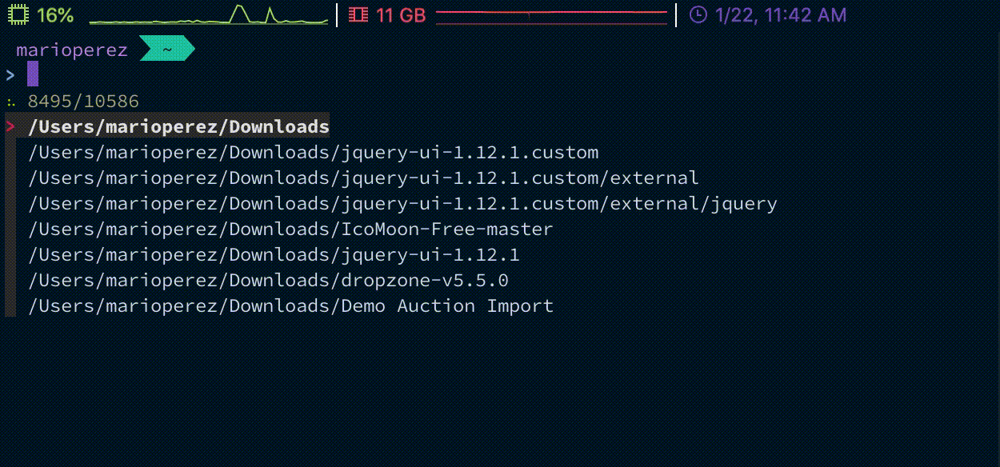

# Dotfiles - thismarioperez



## Installation
1. Install [fzf](https://github.com/junegunn/fzf).
2. Install [nvm](https://github.com/nvm-sh/nvm).
3. Make a `~/Repositories` directory within your filesystem.
4. Run the following command from your terminal:

```
cd ~/Repositories && git clone --recurse-submodules git@github.com:thismarioperez/Dotfiles-Linux.git Dotfiles && cd Dotfiles && chmod 755 ./install.sh && ./install.sh
```

## Misc
### Themes
[Night Owl for vscode](https://github.com/sdras/night-owl-vscode-theme)

[Night Owl for iterm2](https://github.com/nickcernis/iterm2-night-owl)

[Night Owl for windows terminal](https://github.com/edurojasr/Windows-Terminal-Theme-Night-Owl)

[Night Owl for slack](https://github.com/thismarioperez/night-owl-slack) - My personal port of Night Owl for slack

[thismarioperez - zsh-theme](https://github.com/thismarioperez/thismarioperez-zsh-theme) - My personal Night Owl inspired zsh theme
